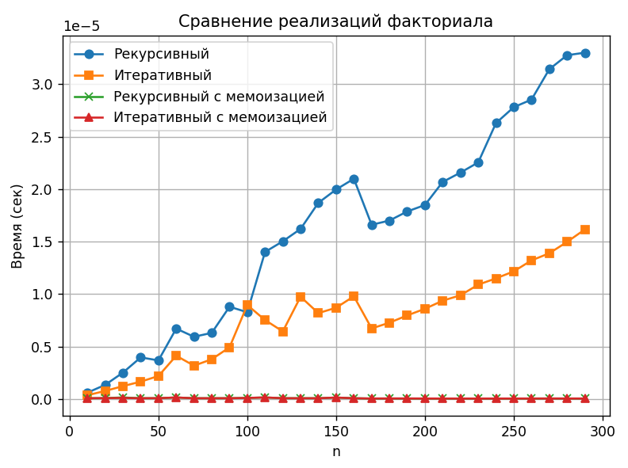

# Лабораторная работа №5

## Постановка задачи  
Сравните время работы двух реализаций функции вычисления факториала:
- рекурсивной,
- нерекурсивной (через цикл).

Изучить материал про мемоизацию и реализовать сравнение мемоизованных и немемоизованных вариантов функций (рекурсивной и нерекурсивной). Проанализировать результаты и сделать выводы, описать выводы в отчете, построить графики.

Для сравнения используйте модуль **timeit**, а для наглядности постройте график с помощью **matplotlib**, показывающий зависимость времени выполнения от входных данных.

Условия:
- Реализуйте две функции `fact_recursive(n)` и `fact_iterative(n)`.
- Для корректного сравнения используйте одинаковый набор чисел для тестирования.
- Визуализируйте результаты (ось X — размер входного числа `n`, ось Y — время вычислений).
- Сравните эффективность двух подходов.

Требования: 
сгенерировать один фиксированный список чисел для всех прогонов и несколько раз запустить вычисления для усреднения.
необходимо провести "чистый бенчмарк" одного вызова (для одного числа) / показать replit. 

## Объяснение кода решения задания

### Реализация функций

Были реализованы четыре функции вычисления факториала:

**Рекурсивная версия** использует классический подход с вызовом самой себя до достижения базового случая `n = 0`.

**Итеративная версия** вычисляет результат через цикл, последовательно перемножая числа от 1 до n.

**Версии с мемоизацией** используют декоратор `@lru_cache(maxsize=None)`, который автоматически кэширует результаты предыдущих вычислений. Это позволяет избежать повторных вычислений для одних и тех же значений n.

### Функция бенчмаркинга

Для точных измерений создана функция `benchmark`, которая:
- Использует `timeit.repeat` для многократных замеров
- Выполняет по 1000 вызовов функции в каждой серии
- Возвращает минимальное среднее время одного вызова
- Использует фиксированный набор чисел от 10 до 290

### Визуализация результатов

График строится с использованием `matplotlib` и включает:
- Ось X — значение n
- Ось Y — время вычислений в секундах
- Четыре линии для каждого варианта реализации

